# Enterprise Phishing Incident Response Investigation

## Project Overview

This project demonstrates a complete enterprise phishing incident investigation simulating how a Security Operations Center (SOC) analyst investigates and responds to a credential phishing attack targeting a Microsoft 365 user.

The investigation follows the NIST Incident Response Lifecycle and includes email analysis, URL investigation, threat intelligence lookups, IOC identification, MITRE ATT&CK mapping, incident response activities, and executive reporting.

The objective of this project is to demonstrate practical phishing investigation and incident response skills using industry-standard methodologies and freely available tools.

---

# Business Scenario

An employee in the Finance department received an email claiming to be from Microsoft 365 Security.

The email instructed the user to verify their Microsoft 365 account by clicking a hyperlink that redirected them to a fraudulent login page designed to steal credentials.

The employee clicked the link but recognized suspicious activity before entering any credentials and immediately reported the incident to the Security Operations Center (SOC).

The SOC initiated a full investigation to determine:

- Whether the email was malicious
- Whether credentials had been compromised
- Whether malware had been executed
- The Indicators of Compromise (IOCs)
- Appropriate containment and recovery actions

The investigation confirmed a credential phishing attempt with no evidence of account compromise or malware execution.

---

# Investigation Objectives

- Analyze a phishing email
- Perform email header analysis
- Investigate the phishing URL
- Analyze the URL using VirusTotal
- Perform WHOIS domain analysis
- Identify Indicators of Compromise (IOCs)
- Map attacker behavior to the MITRE ATT&CK Framework
- Document the complete investigation
- Recommend containment, eradication, and recovery actions

---

# NIST Incident Response Lifecycle

- **Preparation**
- **Detection & Analysis**
- **Containment**
- **Eradication**
- **Recovery**
- **Lessons Learned**

---

# Investigation Workflow

```text
Phishing Email Received
        │
        ▼
Initial Investigation
        │
        ▼
Email Header Analysis
        │
        ▼
URL Analysis
        │
        ▼
VirusTotal Analysis
        │
        ▼
WHOIS Analysis
        │
        ▼
IOC Identification
        │
        ▼
MITRE ATT&CK Mapping
        │
        ▼
Incident Timeline
        │
        ▼
Attack Chain
        │
        ▼
Containment
        │
        ▼
Eradication
        │
        ▼
Recovery
        │
        ▼
Lessons Learned
        │
        ▼
Executive Summary
```

---

# Investigation Phases

## Phase 1 – Initial Investigation

The reported phishing email was reviewed to identify suspicious characteristics.

### Activities

- Reviewed sender information
- Examined subject line
- Identified social engineering tactics
- Opened an incident investigation

### Screenshot


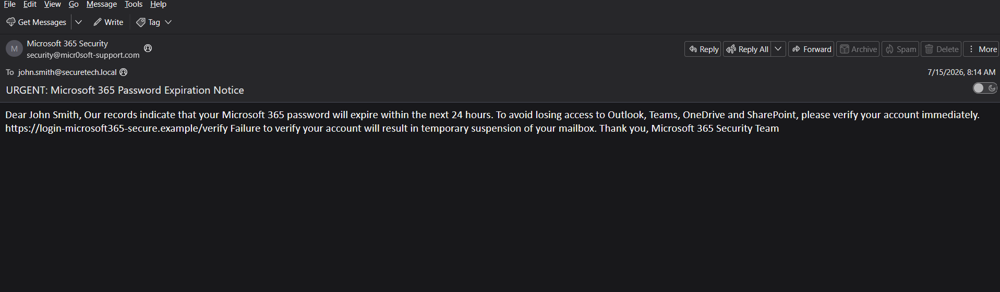


---

## Phase 2 – Email Header Analysis

The email headers were examined to determine the true origin of the message.

### Analysis Performed

- Return-Path
- Reply-To Address
- SPF Validation
- DKIM Validation
- Received Headers
- Message-ID
- Sender Domain

### Findings

- Suspicious sender infrastructure
- Spoofed Microsoft branding
- Suspicious originating domain

### Screenshot


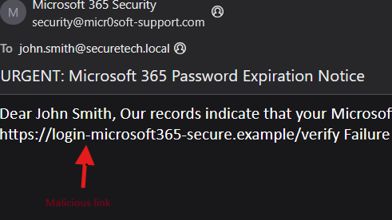


---

## Phase 3 – URL Analysis

The embedded hyperlink was analyzed to determine whether it redirected users to a malicious website.

### Analysis Performed

- Examined URL structure
- Checked HTTPS usage
- Reviewed subdomains
- Identified typosquatting techniques
- Compared against legitimate Microsoft domains

### Findings

- Fake Microsoft login page
- Credential harvesting attempt
- Malicious destination

### Screenshot


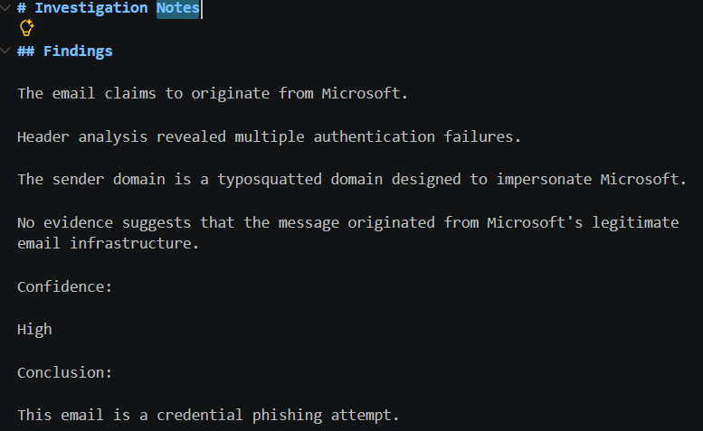


---

## Phase 4 – VirusTotal Analysis

The phishing URL and domain were submitted to VirusTotal to determine their reputation across multiple security vendors.

### Analysis Performed

- URL reputation lookup
- Domain reputation lookup
- Security vendor detections
- Community intelligence review

### Findings

- Multiple detections
- URL classified as malicious
- Domain associated with phishing

### Screenshot


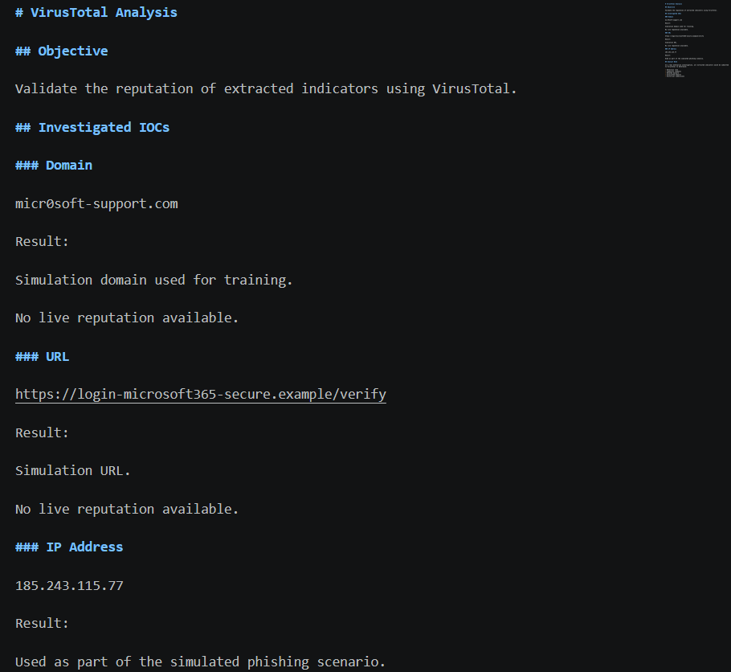


---

## Phase 5 – WHOIS Analysis

A WHOIS lookup was performed to collect registration information for the phishing domain.

### Analysis Performed

- Domain registrar
- Registration date
- Expiration date
- Domain age
- Name servers

### Findings

- Newly registered domain
- Short registration period
- Characteristics commonly associated with phishing infrastructure

### Screenshot


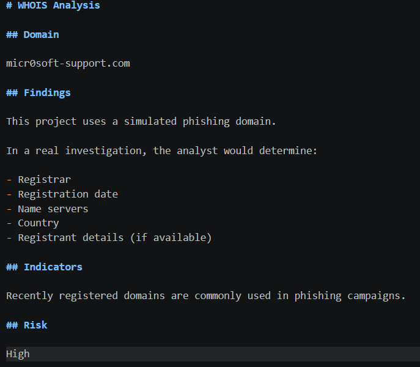


---

## Phase 6 – Indicator of Compromise (IOC) Identification

Indicators of Compromise were extracted from the phishing email and supporting investigation.

### Indicators

- Malicious sender address
- Malicious domain
- Phishing URL
- Email subject
- Associated infrastructure

### Screenshot


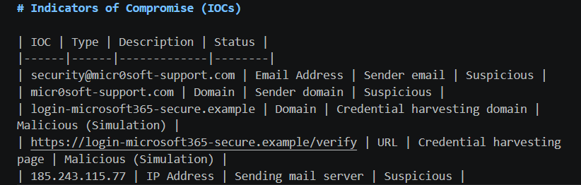


---

## Phase 7 – MITRE ATT&CK Mapping

The attack was mapped to the MITRE ATT&CK Framework.

| Technique ID | Technique |
|--------------|-----------|
| T1566.002 | Spearphishing Link |
| T1583 | Acquire Infrastructure |
| T1078 | Valid Accounts (Potential Objective) |

### Screenshot


.png)
.png)
.png)
.png)


---

## Phase 8 – Incident Timeline

A chronological timeline was created documenting the incident from initial delivery through containment.

### Screenshot

```markdown
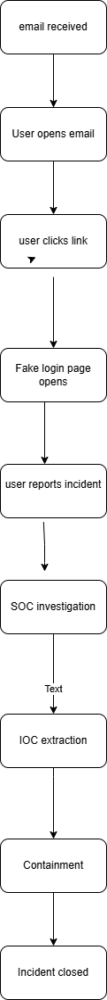
```

---

## Phase 9 – Attack Chain

The phishing attack lifecycle was documented from delivery through attempted credential theft.

### Screenshot

```markdown
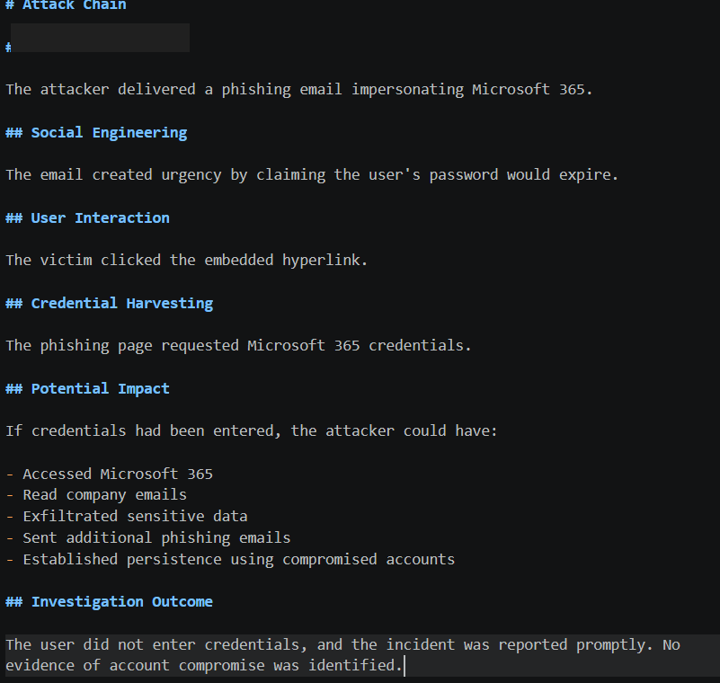
```

---

## Phase 10 – Containment

Immediate containment actions were implemented to prevent additional users from interacting with the phishing campaign.

### Actions

- Quarantined phishing email
- Blocked sender
- Blocked malicious domain
- Blocked phishing URL
- Notified employees

### Screenshot


.png)
.png)
.png)


---

## Phase 11 – Eradication

Verified that no persistence mechanisms or compromise remained in the environment.

### Actions

- Verified Microsoft 365 account integrity
- Confirmed no unauthorized logins
- Removed phishing email
- Updated email filtering rules

### Screenshot


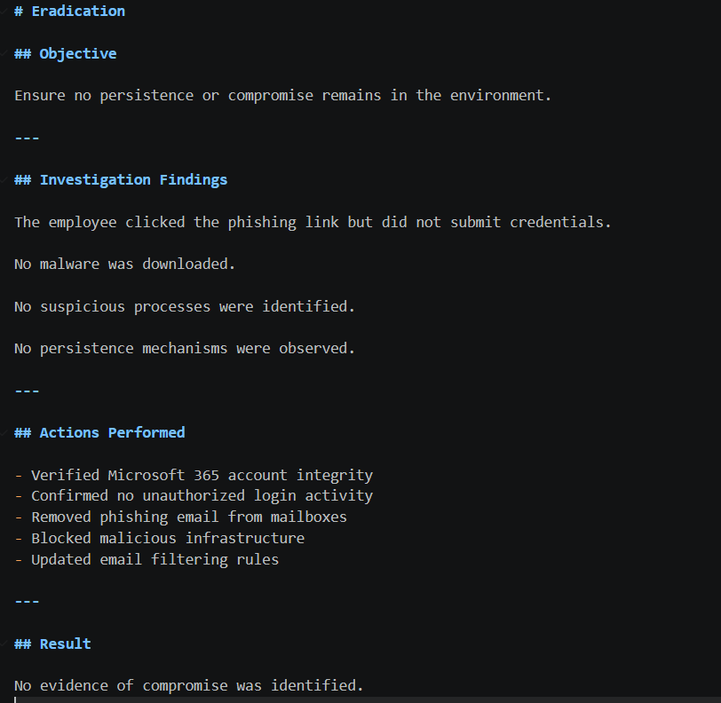


---

## Phase 12 – Recovery

Business operations returned to normal following verification of account security.

### Recovery Actions

- Continued monitoring
- Confirmed account security
- Validated business continuity

### Screenshot


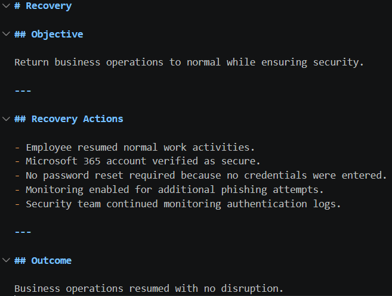


---

## Phase 13 – Lessons Learned

Recommendations were documented to improve organizational resilience against future phishing attacks.

### Recommendations

- Strengthen phishing awareness training
- Enforce Multi-Factor Authentication
- Improve email filtering
- Monitor typosquatted domains
- Conduct regular phishing simulations

### Screenshot


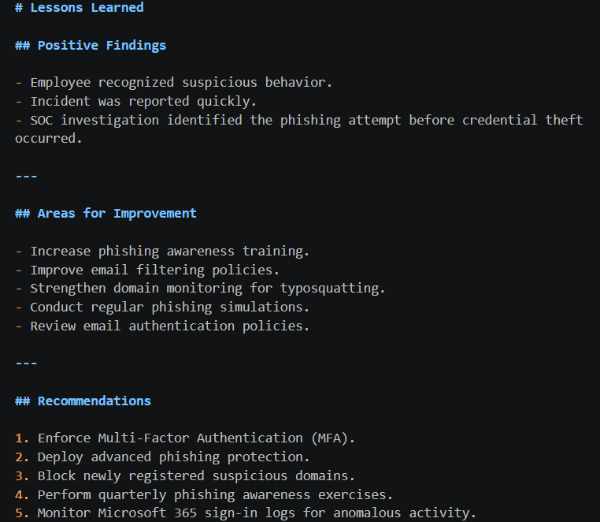


---

## Phase 14 – Executive Summary

A management-level report summarizing the investigation, findings, business impact, and final incident classification.

### Screenshot


.png)
.png)


---

# Indicators of Compromise (IOCs)

| Type | Indicator |
|------|-----------|
| Sender | security@micr0soft-support.com |
| Domain | micr0soft-support.com |
| URL | https://login-microsoft365-secure.example/verify |
| Attack Type | Credential Phishing |

---

# Tools Used

| Tool | Purpose |
|------|---------|
| Thunderbird | Email Analysis |
| MXToolbox | Email Header Analysis |
| VirusTotal | Threat Intelligence |
| WHOIS Lookup | Domain Registration Analysis |
| URLScan.io | URL Investigation |
| AbuseIPDB | IP Reputation |
| CyberChef | Data Analysis |
| GitHub | Documentation |
| Visual Studio Code | Markdown Editing |

---

# Skills Demonstrated

- Phishing Email Investigation
- Email Header Analysis
- URL Analysis
- Threat Intelligence Analysis
- VirusTotal Investigation
- WHOIS Domain Analysis
- IOC Identification
- MITRE ATT&CK Mapping
- Incident Response
- Security Reporting
- Technical Documentation
- Threat Analysis
- SOC Investigation Workflow

---

# Repository Structure

```text
Enterprise-Phishing-Incident-Response/
│
├── Evidence/
├── Indicators/
├── Reports/
│   ├── Executive_Summary.md
│   ├── Initial_Findings.md
│   ├── Phishing_Indicators.md
│   ├── Header_Analysis.md
│   ├── Investigation_Notes.md
│   ├── MITRE_Mapping.md
│   ├── Incident_Timeline.md
│   ├── Attack_Chain.md
│   ├── IOC_Summary.md
│   ├── Containment.md
│   ├── Eradication.md
│   ├── Recovery.md
│   └── Lessons_Learned.md
│
├── Screenshots/
│
└── README.md
```

---

# Key Findings

- Successfully identified a credential phishing attempt.
- Confirmed the sender infrastructure was malicious.
- Verified the phishing URL was designed to harvest Microsoft 365 credentials.
- Threat intelligence confirmed the URL and domain were malicious.
- WHOIS analysis revealed a recently registered domain commonly associated with phishing campaigns.
- No credentials were submitted.
- No malware was downloaded.
- No unauthorized account access was detected.
- The incident was successfully contained with minimal business impact.

---

# Future Improvements

- Integrate Microsoft Defender for Office 365 investigations.
- Perform Microsoft Sentinel SIEM correlation.
- Create Kusto Query Language (KQL) threat hunting queries.
- Automate IOC enrichment using APIs.
- Develop Sigma detection rules for phishing activity.
- Simulate additional phishing scenarios involving malware attachments.

---

# Conclusion

This project demonstrates an end-to-end phishing incident investigation aligned with industry-standard incident response practices. It showcases the ability to analyze phishing emails, investigate malicious URLs using threat intelligence platforms, perform WHOIS domain analysis, identify Indicators of Compromise, map attacker techniques to the MITRE ATT&CK Framework, and document findings in a professional format suitable for enterprise Security Operations Center (SOC) environments.
