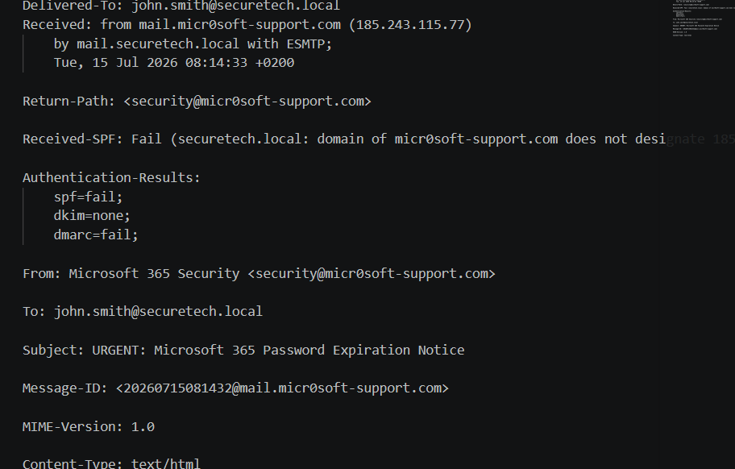

# Enterprise Phishing Incident Response Investigation

## Project Overview

This project simulates an enterprise phishing incident investigated by a Security Operations Center (SOC) analyst.

The investigation follows the complete incident response lifecycle, from the initial phishing email report through evidence collection, IOC extraction, MITRE ATT&CK mapping, containment, eradication, recovery, and lessons learned.

The project demonstrates practical SOC analyst skills using free industry-standard tools and follows a structured investigation methodology suitable for entry-level cybersecurity roles.

---

# Business Scenario

SecureTech Solutions received a report from a Finance department employee regarding a suspicious email claiming that their Microsoft 365 password would expire within 24 hours.

The employee clicked the embedded verification link but became suspicious before entering any credentials and immediately notified the Security Operations Center.

The SOC initiated an investigation to determine:

- Whether the email was malicious
- Whether credentials were compromised
- What indicators of compromise were present
- What containment actions were required

---

# Project Objectives

- Investigate a phishing email
- Analyze email headers
- Identify phishing indicators
- Extract Indicators of Compromise (IOCs)
- Perform threat intelligence analysis
- Map attacker behavior using MITRE ATT&CK
- Build an incident timeline
- Recommend containment, eradication, and recovery actions
- Produce professional incident documentation

---

# Investigation Workflow

1. Initial Incident Report
2. Email Analysis
3. Header Analysis
4. IOC Extraction
5. Threat Intelligence Analysis
6. MITRE ATT&CK Mapping
7. Timeline Reconstruction
8. Containment
9. Eradication
10. Recovery
11. Lessons Learned

---

# Investigation Methodology

The investigation followed the NIST Incident Response Lifecycle:

- Preparation
- Detection & Analysis
- Containment
- Eradication
- Recovery
- Lessons Learned

---

# Tools Used

| Tool | Purpose |
|--------|----------|
| Thunderbird | Email Analysis |
| Visual Studio Code | Documentation |
| MITRE ATT&CK | Adversary Mapping |
| diagrams.net | Timeline Creation |
| GitHub | Documentation & Version Control |
| VirusTotal | Threat Intelligence Methodology (Simulation) |
| URLScan | URL Investigation Methodology (Simulation) |
| WHOIS | Domain Investigation Methodology (Simulation) |

---

# Investigation Phases

## Phase 1 – Initial Email Analysis

The suspicious email was opened using Thunderbird.

The following characteristics were identified:

- Urgent language
- Credential verification request
- Typosquatted Microsoft domain
- External login page

### Screenshot


---

## Phase 2 – Email Header Analysis

Email headers were analyzed to validate sender authenticity.

Findings included:

- SPF Failure
- Missing DKIM
- DMARC Failure
- Suspicious Return-Path
- Typosquatted sender domain

### Screenshot




---

## Phase 3 – IOC Extraction

Indicators extracted included:

- Sender Email
- Sender Domain
- URL
- IP Address

### Screenshot


---

## Phase 4 – MITRE ATT&CK Mapping

Mapped techniques included:

- T1566.002 — Spearphishing Link
- T1204 — User Execution
- T1078 — Valid Accounts
- T1583.001 — Acquire Infrastructure: Domains

### Screenshot

`Screenshots/08-mitre-techniq

---

## Phase 5 – Incident Timeline

A timeline was created documenting each stage of the investigation.

### Screenshot

`Screenshots/09-incident-timeline.png`

---

## Phase 6 – Containment

Actions included:

- Quarantining the phishing email
- Blocking sender domain
- Blocking phishing URL
- Employee notification

### Screenshot

`Screenshots/11-containment-report.png`

---

## Phase 7 – Eradication

Investigation confirmed:

- No malware execution
- No persistence
- No credential compromise

### Screenshot

`Screenshots/12-eradication-report.png`

---

## Phase 8 – Recovery

Business operations resumed without disruption.

### Screenshot

`Screenshots/13-recovery-report.png`

---

# Indicators of Compromise

| Type | Indicator |
|---------|-----------------------------|
| Email | security@micr0soft-support.com |
| Domain | micr0soft-support.com |
| Domain | login-microsoft365-secure.example |
| URL | https://login-microsoft365-secure.example/verify |
| IP Address | 185.243.115.77 |

---

# MITRE ATT&CK Mapping

| Technique | Description |
|------------|----------------------------|
| T1566.002 | Spearphishing Link |
| T1204 | User Execution |
| T1078 | Valid Accounts |
| T1583.001 | Acquire Infrastructure: Domains |

---

# Investigation Outcome

The investigation determined that the email was a credential phishing attempt designed to impersonate Microsoft 365.

The employee interacted with the phishing link but did not submit credentials.

No evidence of compromise or malware execution was identified.

The incident was successfully contained.

---

# Skills Demonstrated

- Incident Response
- Email Analysis
- Header Analysis
- IOC Extraction
- Threat Intelligence
- MITRE ATT&CK
- Documentation
- Security Reporting
- SOC Investigation
- Phishing Analysis
- Technical Writing

---

# Repository Structure

```

Enterprise-Phishing-Incident-Response/

├── Evidence/

├── Indicators/

├── Reports/

├── Screenshots/

├── Diagrams/

└── README.md

```

---

# Lessons Learned

- Phishing attacks continue to rely on social engineering and urgency.
- Typosquatted domains remain an effective impersonation technique.
- Prompt reporting significantly reduces organizational risk.
- Security awareness training is essential for preventing credential theft.

---

# Future Improvements

Future enhancements to this project include:

- Microsoft Sentinel alert investigation
- Microsoft Defender XDR integration
- Email gateway analysis
- Splunk detection engineering
- Sigma detection rule creation
- Automated IOC enrichment
- Threat intelligence platform integration

---

# References

- MITRE ATT&CK Framework
- NIST Computer Security Incident Handling Guide (SP 800-61)
- VirusTotal (Methodology)
- URLScan.io (Methodology)

---

# Author

Mathapelo Mlilo

Aspiring SOC Analyst | IT Support Technician | Cybersecurity Enthusiast

